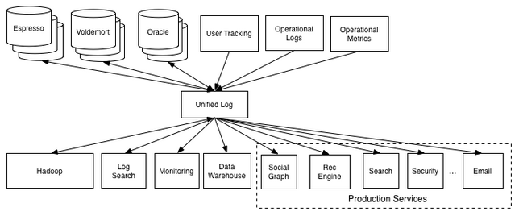

# MessageQueue

There are plenty of message queues and there are plenty of message message queue client libaries.
Some of them include:
[RabbitMQ](https://www.rabbitmq.com/), [Kafka](https://kafka.apache.org/), [AWS SQS](https://aws.amazon.com/sqs/).
and
[Rebus](https://github.com/rebus-org/Rebus), [Masstransit](https://masstransit-project.com/), [Nservicebus](https://particular.net/nservicebus)

## The queues

### RabbitMQ

### SQS

### Kafka

Kafka doesn’t implement the notion of a queue. Instead, Kafka stores collections of records in categories called topics.

For each topic, Kafka maintains a partitioned log of messages. Each partition is an ordered, immutable sequence of records, where messages are continually appended.

Kafka appends messages to these partitions as they arrive. By default, it uses a round-robin partitioner to spread messages uniformly across partitions. (But can use keys to keep messages ordered)

Producers can modify this behavior to create logical streams of messages. For example, in a multitenant application, we might want to create logical message streams according to every message’s tenant ID. In an IoT scenario, we might want to have each producer’s identity map to a specific partition constantly. Making sure all messages from the same logical stream map to the same partition guarantees their delivery in order to consumers.

Consumers consume messages by maintaining an offset (or index) to these partitions and reading them sequentially.

@LinkedIn

Problem:

before vs after

## Compare

AWS SQS $$$ == Performance. Pay for what you need.

## Client libraries

There are ofcourse the native client libraries that can be used. In some cases it is actually best to use those. Other not. Eg. rabbitmq has alot of awesome routing features, that are entirely ignored by most 3rd party clients. On the other hand Kafka doesn't really have any 3rd party clients, because it's specialized nature.

### Rebus

#### Setup

#### Consumer 

When Rebus handles an incoming message, it constructs a handler pipeline. Why is that?

Well, first of all: Your IHandlerActivator may return multiple handler instances when asked to activate handlers for a particular message type. E.g. you might have two things happening upon receiving a CustomerMoved event:

#### Producer

TODO

### Mass transit

#### Setup and Consumer

#### Producer

### RabbitMQ Native

https://www.rabbitmq.com/tutorials/tutorial-one-dotnet.html

### SQS Native

https://docs.aws.amazon.com/sdk-for-net/v3/developer-guide/sqs-apis-intro.html

### Kafka - Confluent kafka client

https://github.com/gabrielsadaka/dotnet-kafka-sample

Really awesome unknown example

sources:
https://medium.com/better-programming/rabbitmq-vs-kafka-1ef22a041793

https://www.confluent.io/blog/kafka-fastest-messaging-system/

https://eng.uber.com/reliable-reprocessing/

https://engineering.linkedin.com/distributed-systems/log-what-every-software-engineer-should-know-about-real-time-datas-unifying